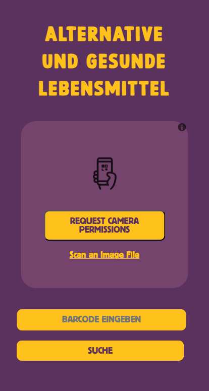

# 🍏 Healthy Product Alternatives

This project is a simple web application that allows users to scan or input a product and determine if it's unhealthy. If the product is unhealthy, the application recommends healthier alternatives from the same category.

## Features

- **Product Scanning/Input:** Scan or enter a product to get nutritional information.
- **Health Assessment:** Check if the product is healthy based on its nutritional score.
- **Healthy Alternatives:** Provide healthier product alternatives from the same category.
- **Image Display:** Display images of both the scanned product and its healthier alternatives.
- **Loading Indicator:** Show a loading indicator while searching for healthier alternatives.

## Demo

[Live demo](https://thetechnikfreak.github.io/alternativfood/) 


## Installation

1. Clone the repository:
   ```sh
   git clone https://github.com/yourusername/healthy-product-alternatives.git
   cd healthy-product-alternatives
   ```
2. Open `index.html` in your preferred web browser.

## Usage

1. Open the application.
2. Input a product code in the search bar or scan a barcode.
3. Click "Search" to get the nutritional information of the product.
4. If the product is unhealthy, healthier alternatives will be displayed.

## Technologies Used

- HTML, CSS
- JavaScript
- OpenFoodFacts API
- Chatanywhere API


## API Integration

This project uses the [OpenFoodFacts API](https://world.openfoodfacts.org/data) to fetch product information and the [Chatanywhere API](https://github.com/chatanywhere/GPT_API_free) to get the cateogry of a product.